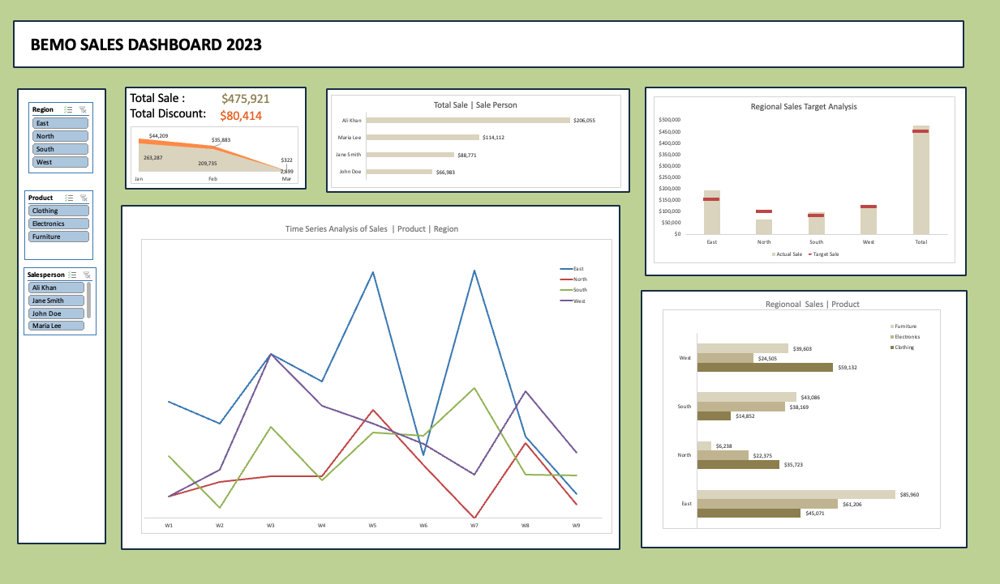

# Sales-Analysis
Bemo Sales Dashboard

**Business metrics and dimensions:** Total sales units, Total revenue, Total discount,
target achievement rate (%), Monthly revenue growth rate (%)

**Summery of Insights:**
1. **Sales Trends**: The total actual sales met the target sales with 5%. Particularly
the East and South regions perform well by 23% and 20% overflow over target
sales. The North region needs the most improvement as it fails to meet the
target by 35%, particularly furniture and electronics.However, both the total units sold and total sales show a downward trend from
January to March, indicating a 23% decline in sales performance over January
to February

2. **Regional Sales**: The time series analysis reveals fluctuations in sales for all
regions, with peaks in certain weeks, especially for the East region, which
consistently performs better than the others. A majority of East regional sales
come from February's first and third weeks.
3. **Sales Person Trends**: The top-performing salesperson is Ali Khan throughout
all regions, responsible for around 50% of total sales ($206,000). The second
and third top-performing salespersons are Maria Lee and Jane Smith.
4. **Product Category Breakdown**: Furniture leads in total sales, followed by
clothing and electronics. The majority of furniture sales occur in the East, West,
and South regions, with the North having the lowest sales for this category.
Clothing ranks as the second-best-selling item overall. However, in terms of
clothing, the West region performed well, while the South region consistently
underperformed compared to other regions during the entire period.
Electronic sales peaked in the East region at the end of January and in
February, while the North and West regions consistently underperformed
during this period.

**Recommendations**:
● **Investigate Sales Incline and Decline:** The East region performed
exceptionally well throughout January and the first three weeks of February. In
contrast, the West region performed well in clothing in January (third week),
while the North region showed particularly poor performance in furniture sales.
Analyzing factors such as market conditions, product availability, and seasonal
demand can help identify the underlying reasons.
● **Focus on Areas on High-Performing Products:** Strengthen strategies in the
West and North for clothing and in the East region for furniture products where
sales are consistently high.
● **Improve Underperforming Areas:** Addressing low sales in regions like the
North, with a focus on furniture and electronics, the marketing efforts and
strategies need reformation.
● **Leverage Sales Team Strengths:** Recognizing top-performing salespeople,
such as Ali Khan, and incentivizing their efforts can motivate others. Additionally,
offering further training to lower-performing salespeople, like John Doe, can help
balance overall performance.
● **Seasonal Promotions:** There is a decline in sales from January to February.
Promotional activities can boost sales during slower periods, particularly focusing
sales in February to March.
